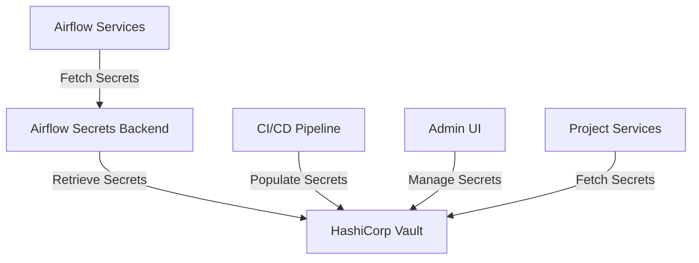

# Secrets Management Architecture: HashiCorp Vault Integration

## Overview

This document outlines the architectural approach for implementing a robust secrets management solution for the airflow-hub repository, with a primary focus on HashiCorp Vault integration. The goal is to address the current issues with secrets management and provide a secure, scalable solution for production use.

## Current State Issues

1. Inconsistent environment variable management using .env files
2. No integration with external secrets backends despite recommendations in docs
3. No clear separation between development and production environments
4. No centralized approach to secrets management across projects
5. Potential security concerns for production use

## Target Architecture

The target architecture will use HashiCorp Vault as the primary secrets backend for Airflow, providing a centralized, secure solution for managing all sensitive information.



## HashiCorp Vault Integration

### 1. Vault Setup

#### 1.1 Vault Deployment Options

For development:
- Docker container running Vault in dev mode
- Simple setup for local testing

For production:
- High-availability Vault cluster
- Proper authentication and authorization
- Regular backups and disaster recovery

#### 1.2 Vault Configuration

```hcl
# Example Vault configuration for production
storage "raft" {
  path    = "/vault/data"
  node_id = "node1"
}

listener "tcp" {
  address     = "0.0.0.0:8200"
  tls_disable = "true"  # Enable TLS in production
}

api_addr = "http://vault:8200"
cluster_addr = "https://vault:8201"
ui = true
```

### 2. Secret Path Structure

Organize secrets in Vault with a clear path structure:

```
secret/
├── airflow/
│   ├── connections/
│   │   ├── project_trading_ibkr
│   │   ├── project_analytics_snowflake
│   │   └── project_market_analysis_api
│   └── variables/
│       ├── project_trading/
│       ├── project_analytics/
│       └── project_market_analysis/
└── projects/
    ├── trading/
    │   ├── api_keys
    │   └── credentials
    ├── analytics/
    │   └── credentials
    └── market_analysis/
        └── api_keys
```

### 3. Airflow Configuration

Update Airflow configuration to use Vault as the secrets backend:

```python
# In airflow.cfg or as environment variables
AIRFLOW__SECRETS__BACKEND = "airflow.providers.hashicorp.secrets.vault.VaultBackend"
AIRFLOW__SECRETS__BACKEND_KWARGS = {
    "connections_path": "airflow/connections",
    "variables_path": "airflow/variables",
    "mount_point": "secret",
    "url": "http://vault:8200",
    "token": "s.your-vault-token",  # Use approle or another auth method in production
    "auth_type": "token"  # Change to "approle" for production
}
```

## Implementation Plan

### Phase 1: Development Environment Setup

1. **Add Vault to Docker Compose**

```yaml
# Addition to docker-compose.yml
services:
  vault:
    image: hashicorp/vault:1.12.0
    ports:
      - "8200:8200"
    environment:
      VAULT_DEV_ROOT_TOKEN_ID: dev-only-token
      VAULT_DEV_LISTEN_ADDRESS: 0.0.0.0:8200
    cap_add:
      - IPC_LOCK
    command: server -dev
```

2. **Update Airflow Services Configuration**

```yaml
# Update to airflow services in docker-compose.yml
services:
  airflow-webserver:
    # ... existing configuration ...
    environment:
      # ... existing environment variables ...
      AIRFLOW__SECRETS__BACKEND: "airflow.providers.hashicorp.secrets.vault.VaultBackend"
      AIRFLOW__SECRETS__BACKEND_KWARGS: '{"connections_path": "airflow/connections", "variables_path": "airflow/variables", "mount_point": "secret", "url": "http://vault:8200", "token": "dev-only-token"}'
    depends_on:
      # ... existing dependencies ...
      vault:
        condition: service_healthy

  airflow-scheduler:
    # ... existing configuration ...
    environment:
      # ... existing environment variables ...
      AIRFLOW__SECRETS__BACKEND: "airflow.providers.hashicorp.secrets.vault.VaultBackend"
      AIRFLOW__SECRETS__BACKEND_KWARGS: '{"connections_path": "airflow/connections", "variables_path": "airflow/variables", "mount_point": "secret", "url": "http://vault:8200", "token": "dev-only-token"}'
    depends_on:
      # ... existing dependencies ...
      vault:
        condition: service_healthy
```

3. **Add Vault Health Check**

```yaml
# Add to vault service in docker-compose.yml
healthcheck:
  test: ["CMD", "vault", "status"]
  interval: 10s
  timeout: 5s
  retries: 3
```

4. **Update Requirements**

Add the required packages to requirements.txt:

```
apache-airflow-providers-hashicorp>=2.2.0
hvac>=1.0.2
```

### Phase 2: Vault Initialization and Secret Migration

1. **Create Initialization Script**

Create a script to initialize Vault and populate it with secrets:

```python
# scripts/init_vault.py
import hvac
import os
import json
from typing import Dict, Any

# Vault client setup
client = hvac.Client(url='http://vault:8200', token=os.environ.get('VAULT_TOKEN', 'dev-only-token'))

# Check if Vault is initialized
if not client.sys.is_initialized():
    print("Vault is not initialized. This script assumes a dev mode Vault instance.")
    exit(1)

# Define connections to migrate
connections = {
    'project_trading_ibkr': {
        'conn_type': 'http',
        'host': 'api.ibkr.com',
        'login': 'your_account_id',
        'password': 'your_api_key',
        'port': 443,
        'extra': json.dumps({
            'client_id': 0,
            'read_only': True
        })
    },
    'project_analytics_snowflake': {
        'conn_type': 'snowflake',
        'host': 'your_account.snowflakecomputing.com',
        'login': 'your_username',
        'password': 'your_password',
        'schema': 'your_database',
        'extra': json.dumps({
            'warehouse': 'your_warehouse',
            'role': 'your_role'
        })
    },
    # Add more connections as needed
}

# Migrate connections to Vault
for conn_id, conn_config in connections.items():
    path = f'secret/airflow/connections/{conn_id}'
    print(f"Writing connection {conn_id} to Vault at {path}")
    client.secrets.kv.v2.create_or_update_secret(
        path=path,
        secret=conn_config
    )

# Define variables to migrate
variables = {
    'project_trading/api_key': 'your_api_key',
    'project_trading/api_secret': 'your_api_secret',
    # Add more variables as needed
}

# Migrate variables to Vault
for var_name, var_value in variables.items():
    path = f'secret/airflow/variables/{var_name}'
    print(f"Writing variable {var_name} to Vault at {path}")
    client.secrets.kv.v2.create_or_update_secret(
        path=path,
        secret={'value': var_value}
    )

print("Vault initialization complete!")
```

2. **Create Migration Script for Existing Connections**

```python
# scripts/migrate_connections.py
from airflow.models import Connection
from airflow.settings import Session
import hvac
import os
import json

# Vault client setup
client = hvac.Client(url='http://vault:8200', token=os.environ.get('VAULT_TOKEN', 'dev-only-token'))

# Get all connections from Airflow DB
session = Session()
connections = session.query(Connection).all()

# Migrate each connection to Vault
for conn in connections:
    conn_id = conn.conn_id
    conn_config = {
        'conn_type': conn.conn_type,
        'host': conn.host,
        'login': conn.login,
        'password': conn.password,
        'schema': conn.schema,
        'port': conn.port,
        'extra': conn.extra
    }
    
    path = f'secret/airflow/connections/{conn_id}'
    print(f"Migrating connection {conn_id} to Vault at {path}")
    
    client.secrets.kv.v2.create_or_update_secret(
        path=path,
        secret=conn_config
    )

print(f"Migrated {len(connections)} connections to Vault")
session.close()
```

### Phase 3: Update Hooks and Operators

1. **Ensure Hooks Use Connection IDs**

Review and update all hooks to use connection IDs consistently:

```python
# Example update to a hook
class IBKRHook(BaseHook):
    def __init__(self, conn_id='project_trading_ibkr'):
        super().__init__()
        self.conn_id = conn_id
        self.connection = self.get_connection(conn_id)
        # Rest of the hook implementation
```

2. **Remove Direct Environment Variable References**

Replace any direct environment variable references with Airflow connections or variables:

```python
# Before
api_key = os.environ.get('BINANCE_API_KEY')
api_secret = os.environ.get('BINANCE_API_SECRET')

# After
connection = BaseHook.get_connection('project_trading_binance')
api_key = connection.password
api_secret = connection.extra_dejson.get('api_secret')
```

### Phase 4: Production Configuration

1. **Vault Production Setup**

For production, use a more secure Vault configuration:

- Use TLS for all communications
- Use AppRole or another authentication method instead of tokens
- Set up proper access policies
- Configure audit logging

2. **Airflow Production Configuration**

Update the Airflow configuration for production:

```python
# Production configuration
AIRFLOW__SECRETS__BACKEND = "airflow.providers.hashicorp.secrets.vault.VaultBackend"
AIRFLOW__SECRETS__BACKEND_KWARGS = {
    "connections_path": "airflow/connections",
    "variables_path": "airflow/variables",
    "mount_point": "secret",
    "url": "https://vault.your-domain.com:8200",
    "auth_type": "approle",
    "role_id": "your-role-id",
    "secret_id": "your-secret-id"
}
```

## Usage Examples

### 1. Accessing Connections in DAGs and Operators

```python
from airflow.hooks.base import BaseHook

# In a DAG or operator
connection = BaseHook.get_connection('project_trading_ibkr')
api_key = connection.password
account_id = connection.login
```

### 2. Using Variables

```python
from airflow.models import Variable

# In a DAG or operator
api_key = Variable.get('project_trading/api_key')
```

### 3. Creating New Connections via Airflow UI

With Vault as the backend, connections created via the Airflow UI will be stored in Vault automatically.

## Testing the Integration

1. **Verify Vault Connection**

```bash
# Test Vault connectivity
curl -s http://localhost:8200/v1/sys/health | jq
```

2. **Test Airflow-Vault Integration**

```python
# scripts/test_vault_integration.py
from airflow.hooks.base import BaseHook
from airflow.models import Variable
import sys

# Test retrieving a connection
try:
    conn = BaseHook.get_connection('project_trading_ibkr')
    print(f"Successfully retrieved connection: {conn.conn_id}")
    print(f"Host: {conn.host}")
    print(f"Login: {conn.login}")
    print(f"Password exists: {'Yes' if conn.password else 'No'}")
except Exception as e:
    print(f"Error retrieving connection: {e}")
    sys.exit(1)

# Test retrieving a variable
try:
    var = Variable.get('project_trading/api_key', default_var=None)
    if var:
        print(f"Successfully retrieved variable with value length: {len(var)}")
    else:
        print("Variable not found")
except Exception as e:
    print(f"Error retrieving variable: {e}")
    sys.exit(1)

print("Vault integration test completed successfully!")
```

## Security Considerations

1. **Token Management**
   - Never store Vault tokens in code or commit them to the repository
   - Use short-lived tokens or AppRole authentication
   - Implement token rotation

2. **Access Control**
   - Implement least privilege access policies
   - Restrict access to specific paths based on service needs
   - Audit access regularly

3. **Secrets Rotation**
   - Implement a process for regular rotation of secrets
   - Automate rotation where possible
   - Document emergency procedures for compromised credentials

## Next Steps

After implementing the HashiCorp Vault integration, consider these follow-up improvements:

1. Implement environment-specific configurations
2. Enhance Docker security practices
3. Create comprehensive documentation for developers
4. Set up monitoring and alerting for Vault
5. Implement automated secret rotation

## Conclusion

This architecture provides a secure, centralized approach to secrets management using HashiCorp Vault as the primary backend. By implementing this solution, the airflow-hub repository will have a production-ready secrets management system that addresses the current issues and provides a foundation for future enhancements.